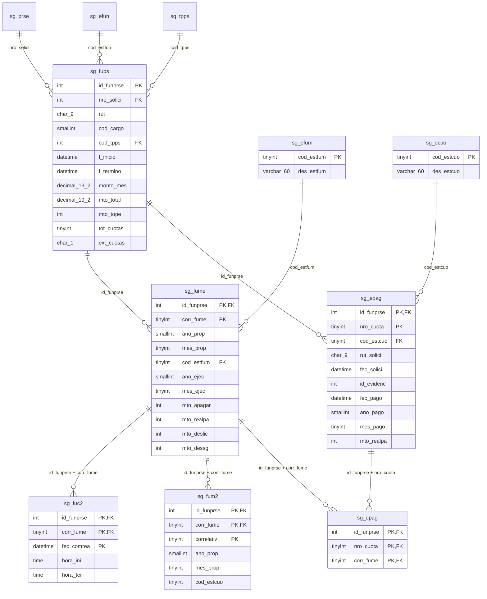

# Modelo BDD actualizado — prestaciones y pagos DU288

**Actualizado:** 01-10-2026 (revisión 2 — `sg_epag`, `sg_dpag` y `sg_ecuo` desplegadas)  
**Base:** `secgen_db` · esquema `dbo`  
**Objetivo:** referencia de consulta para la integración de cuotas, meses de pago,
compensaciones y extensión de cuotas.

> [!IMPORTANT]
> Los datos de la **Resolución Exenta son de solo lectura** en este flujo. Se consultan y se
> muestran, pero esta integración **no crea, actualiza ni elimina** información de resolución
> en `sg_soli`, `sg_rslc` ni en otra tabla de resolución.

## 1. Estado de esta referencia

| Clasificación | Contenido |
| :--- | :--- |
| Desplegado y confirmado | `sg_efum`, `sg_ecuo`, `sg_fume`, `sg_fups`, `sg_epag`, `sg_dpag`, `sg_fuc2` y `sg_fum2`; incluye `sg_fups.ext_cuotas` |
| Solo lectura | Número, fecha, estado y demás antecedentes de la resolución que se muestran en consultas y comparadores |
| Regla transversal | `ext_cuotas` se persiste por funcionario/prestación (`id_funprse`) y condiciona cuotas, cupo de meses, tope y cálculos |
| Falta antes de escribir cuotas | Índice único de `sg_dpag`, desfase de `sg_fum2` e historial de `sg_epag` — ver §8 |

Con `sg_epag` y `sg_dpag` en la base, el grano de tres niveles queda cerrado:

```
sg_prse  (nro_solici)                             cabecera: actividad, centro de costo, jefe de proyecto
  sg_fups  (id_funprse)                           UN funcionario y su marco autorizado
    sg_fume  (id_funprse, corr_fume)              un MES propuesto
    sg_epag  (id_funprse, nro_cuota)              una CUOTA de ese funcionario
      sg_dpag  (id_funprse, nro_cuota, corr_fume) qué meses abarca la cuota
```

> [!IMPORTANT]
> La cuota cuelga del **funcionario**, no de la resolución: `sg_epag.id_funprse` está en la PK.
> Una resolución con N funcionarios produce N encabezados de cuota.
>
> El jefe de proyecto, en cambio, está en `sg_prse.rut_jefpro`, a nivel de solicitud. Por eso
> la pantalla de gestión es **por resolución** aunque cada cuota se cree por funcionario: el
> saldo y el tope que hay que validar son del centro de costo, y validarlos de a un funcionario
> deja pasar la suma.

## 2. Diagrama lógico vigente



Las tres tablas de pago (`sg_ecuo`, `sg_epag`, `sg_dpag`) ya están creadas en `secgen_db`. La
relación `sg_fume → sg_dpag` se representa como FK compuesta por `(id_funprse, corr_fume)`;
ver §6 sobre cómo aparece en el DDL exportado.

## 3. Responsabilidad de cada tabla

| Tabla | Responsabilidad |
| :--- | :--- |
| `sg_prse` | Cabecera de la solicitud de prestación y centro de costo |
| `sg_fups` | Funcionario asociado y marco autorizado: período, montos, tope, total de cuotas y marca `ext_cuotas` |
| `sg_fume` | Meses propuestos/ejecutados de la prestación y estado operativo de cada mes |
| `sg_efum` | Catálogo de estados de `sg_fume` |
| `sg_epag` | Encabezado de cuota del funcionario: estado del trámite, mes de pago, respaldo y monto enviado |
| `sg_ecuo` | Catálogo de estados de `sg_epag` (el trámite de la cuota), distinto de `sg_efum` (el mes) |
| `sg_dpag` | Asociación entre una cuota de `sg_epag` y uno o más meses de `sg_fume` |
| `sg_fuc2` | Compensaciones realmente informadas para un mes de `sg_fume` |
| `sg_fum2` | Historial/versionado de los cambios de un registro mensual de `sg_fume` |
| `sg_fuho` | Horario semanal comprometido por el funcionario |
| `sg_fuco` | Compensaciones declaradas en la prestación, distintas de las realizadas en `sg_fuc2` |

## 4. Contrato de `ext_cuotas`

- La fuente persistida es `sg_fups.ext_cuotas` (`char(1)`, valores normalizados `S` o `N`).
- La marca pertenece al registro del funcionario/prestación identificado por `id_funprse`.
- En DU288 actualmente existe un solo funcionario; por eso el backend puede exponer el mismo
  valor a nivel del formulario, pero no se crea una segunda fuente de verdad en la BDD.
- Al crear o editar se guarda junto con `tot_cuotas`; al consultar se recupera desde `sg_fups`.
- Cambiar la marca obliga a reevaluar cuotas, cupo de meses, montos, tope y cargos aplicables.
- `S`: aplica el régimen de extensión y las validaciones/PA deben recibir esa marca.
- `N` o `NULL` histórico: se trata como prestación ordinaria. Para nuevos guardados se debe
  persistir explícitamente `N` cuando no hay extensión.
- Una prestación extendida y una ordinaria del mismo centro de costo no deben mezclarse como si
  compartieran idéntico régimen. La comparación debe advertir la diferencia y cada cálculo debe
  usar la marca persistida de la prestación evaluada.

## 5. Resolución: frontera de solo lectura

En las pantallas de pagos y comparación se pueden mostrar, entre otros, el número de resolución,
su fecha, estado y documento. Esos datos se obtienen mediante consultas a las fuentes existentes
(`sg_soli`/`sg_rslc` y sus PA), pero **no forman parte del modelo editable de pagos**.

Por lo tanto, este alcance no debe incorporar:

- `INSERT`, `UPDATE` ni `DELETE` sobre tablas de resolución;
- sincronización inversa desde cuotas, `ext_cuotas`, montos o compensaciones hacia la resolución;
- controles editables de resolución en formularios de pagos o comparadores.

Sí corresponde conservar la referencia necesaria para identificar y visualizar la resolución de
la prestación. Mostrar el dato no autoriza a modificarlo.

## 6. Cómo leer las FK de `sg_dpag` hacia `sg_fume`

El DDL exportado muestra dos declaraciones que, leídas literalmente, entregarían **una** columna
de origen contra una clave de **dos** en destino:

```sql
FK_sg_dpag_sg_fume    FOREIGN KEY (corr_fume)  REFERENCES sg_fume(id_funprse, corr_fume)
FK_sg_dpag_sg_fume_3  FOREIGN KEY (id_funprse) REFERENCES sg_fume(id_funprse, corr_fume)
```

No es un defecto del modelo: es **cómo la herramienta de exportación parte una FK compuesta**,
una línea por columna, repitiendo la clave destino completa en cada una. La misma forma aparece
en `sg_apso`, que opera en producción desde hace años:

```sql
FK_sg_apso_sg_eta1    FOREIGN KEY (cod_etapa)  REFERENCES sg_eta1(cod_flusol, cod_etapa)
FK_sg_apso_sg_eta1_2  FOREIGN KEY (cod_flusol) REFERENCES sg_eta1(cod_flusol, cod_etapa)
```

Además las tablas se crearon sin error, de modo que el servidor aceptó lo que realmente se le
envió. La relación vigente es la compuesta:

```sql
FOREIGN KEY (id_funprse, corr_fume) REFERENCES sg_fume(id_funprse, corr_fume)
```

Queda una verificación de rutina antes de escribir la primera cuota — confirmar que el catálogo
tiene una FK compuesta y no dos sueltas:

```sql
sp_helpconstraint 'secgen_db.dbo.sg_dpag'
```

## 7. DDL de referencia recibido

El bloque siguiente se conserva para consulta. No debe ejecutarse completo como script de
despliegue: incluye tablas fuera del alcance puntual y las FK de `sg_dpag` observadas arriba.

```sql
-- secgen_db.dbo.sg_apso definition

-- Drop table

-- DROP TABLE secgen_db.dbo.sg_apso;

CREATE TABLE secgen_db.dbo.sg_apso (
	nro_aproba int NOT NULL,
	nro_solici int NOT NULL,
	rut_usua char(9) NOT NULL,
	cod_estapr tinyint NOT NULL,
	comentario text NULL,
	f_aprobac datetime NULL,
	f_creacion datetime NULL,
	f_ultmodif datetime NULL,
	cod_flusol tinyint NULL,
	cod_etapa tinyint NULL,
	rut_autori char(9) NULL,
	id_funprse int NULL,
	CONSTRAINT SG_APSO_PK PRIMARY KEY (nro_aproba)
);
CREATE INDEX NC_sg_apso_rut ON secgen_db.dbo.sg_apso (rut_usua);
CREATE INDEX NC_sg_apso_soli ON secgen_db.dbo.sg_apso (nro_solici);
CREATE UNIQUE INDEX PK_sg_apso ON secgen_db.dbo.sg_apso (nro_aproba);


-- secgen_db.dbo.sg_dpag definition

-- Drop table

-- DROP TABLE secgen_db.dbo.sg_dpag;

CREATE TABLE secgen_db.dbo.sg_dpag (
	id_funprse int NOT NULL,
	nro_cuota tinyint NOT NULL,
	corr_fume tinyint NOT NULL,
	CONSTRAINT SG_DPAG_PK PRIMARY KEY (id_funprse,nro_cuota,corr_fume)
);
CREATE UNIQUE INDEX PK_sg_dpag ON secgen_db.dbo.sg_dpag (id_funprse,nro_cuota,corr_fume);


-- secgen_db.dbo.sg_ecuo definition

-- Drop table

-- DROP TABLE secgen_db.dbo.sg_ecuo;

CREATE TABLE secgen_db.dbo.sg_ecuo (
	cod_estcuo tinyint NOT NULL,
	des_estcuo varchar(60) NOT NULL,
	CONSTRAINT SG_ECUO_PK PRIMARY KEY (cod_estcuo)
);
CREATE UNIQUE INDEX PK_sg_ecuo ON secgen_db.dbo.sg_ecuo (cod_estcuo);


-- secgen_db.dbo.sg_efum definition

-- Drop table

-- DROP TABLE secgen_db.dbo.sg_efum;

CREATE TABLE secgen_db.dbo.sg_efum (
	cod_estfum tinyint NOT NULL,
	des_estfum varchar(60) NOT NULL,
	CONSTRAINT SG_EFUM_PK PRIMARY KEY (cod_estfum)
);
CREATE UNIQUE INDEX PK_sg_efum ON secgen_db.dbo.sg_efum (cod_estfum);


-- secgen_db.dbo.sg_efun definition

-- Drop table

-- DROP TABLE secgen_db.dbo.sg_efun;

CREATE TABLE secgen_db.dbo.sg_efun (
	cod_estfun tinyint NOT NULL,
	des_estfun varchar(60) NOT NULL,
	CONSTRAINT SG_EFUN_PK PRIMARY KEY (cod_estfun)
);
CREATE UNIQUE INDEX PK_sg_efun ON secgen_db.dbo.sg_efun (cod_estfun);


-- secgen_db.dbo.sg_epag definition

-- Drop table

-- DROP TABLE secgen_db.dbo.sg_epag;

CREATE TABLE secgen_db.dbo.sg_epag (
	id_funprse int NOT NULL,
	nro_cuota tinyint NOT NULL,
	cod_estcuo tinyint NULL,
	rut_solici char(9) NULL,
	fec_solici datetime NULL,
	id_evidenc int NULL,
	fec_pago datetime NULL,
	ano_pago smallint NULL,
	mes_pago tinyint NULL,
	mto_realpa int NULL,
	CONSTRAINT SG_EPAG_PK PRIMARY KEY (id_funprse,nro_cuota)
);
CREATE UNIQUE INDEX PK_sg_epag ON secgen_db.dbo.sg_epag (id_funprse,nro_cuota);


-- secgen_db.dbo.sg_fuc2 definition

-- Drop table

-- DROP TABLE secgen_db.dbo.sg_fuc2;

CREATE TABLE secgen_db.dbo.sg_fuc2 (
	id_funprse int NOT NULL,
	corr_fume tinyint NOT NULL,
	fec_comrea datetime NOT NULL,
	hora_ini time(3) NOT NULL,
	hora_ter time(3) NOT NULL,
	CONSTRAINT SG_FUC2_PK PRIMARY KEY (id_funprse,corr_fume,fec_comrea)
);
CREATE UNIQUE INDEX PK_sg_fuc2 ON secgen_db.dbo.sg_fuc2 (id_funprse,corr_fume,fec_comrea);


-- secgen_db.dbo.sg_fuco definition

-- Drop table

-- DROP TABLE secgen_db.dbo.sg_fuco;

CREATE TABLE secgen_db.dbo.sg_fuco (
	id_funprse int NOT NULL,
	fec_compro datetime NOT NULL,
	hora_ini time(3) NOT NULL,
	hora_ter time(3) NOT NULL,
	CONSTRAINT SG_FUCO_PK PRIMARY KEY (id_funprse,fec_compro)
);
CREATE UNIQUE INDEX PK_sg_fuco ON secgen_db.dbo.sg_fuco (id_funprse,fec_compro);


-- secgen_db.dbo.sg_fuho definition

-- Drop table

-- DROP TABLE secgen_db.dbo.sg_fuho;

CREATE TABLE secgen_db.dbo.sg_fuho (
	id_funprse int NOT NULL,
	cod_diasem tinyint NOT NULL,
	correlativ tinyint NOT NULL,
	hora_ini time(3) NOT NULL,
	hora_ter time(3) NOT NULL,
	CONSTRAINT SG_FUHO_PK PRIMARY KEY (id_funprse,cod_diasem,correlativ)
);
CREATE UNIQUE INDEX PK_sg_fuho ON secgen_db.dbo.sg_fuho (id_funprse,cod_diasem,correlativ);


-- secgen_db.dbo.sg_fum2 definition

-- Drop table

-- DROP TABLE secgen_db.dbo.sg_fum2;

CREATE TABLE secgen_db.dbo.sg_fum2 (
	id_funprse int NOT NULL,
	corr_fume tinyint NOT NULL,
	correlativ tinyint NOT NULL,
	ano_prop smallint NOT NULL,
	mes_prop tinyint NOT NULL,
	cod_estcuo tinyint NOT NULL,
	ano_ejec smallint NULL,
	mes_ejec tinyint NULL,
	mto_apagar int NULL,
	id_evidenc int NULL,
	val_licmed char(1) NULL,
	val_inabili char(1) NULL,
	val_singoce char(1) NULL,
	val_ciecc char(1) NULL,
	fec_valida datetime NULL,
	rut_autori char(9) NULL,
	fec_autori datetime NULL,
	fec_envrem datetime NULL,
	CONSTRAINT SG_FUM2_PK PRIMARY KEY (id_funprse,corr_fume,correlativ)
);
CREATE UNIQUE INDEX PK_sg_fum2 ON secgen_db.dbo.sg_fum2 (id_funprse,corr_fume,correlativ);


-- secgen_db.dbo.sg_fume definition

-- Drop table

-- DROP TABLE secgen_db.dbo.sg_fume;

CREATE TABLE secgen_db.dbo.sg_fume (
	id_funprse int NOT NULL,
	corr_fume tinyint NOT NULL,
	ano_prop smallint NOT NULL,
	mes_prop tinyint NOT NULL,
	cod_estfum tinyint NOT NULL,
	ano_ejec smallint NULL,
	mes_ejec tinyint NULL,
	mto_apagar int NULL,
	id_evidenc int NULL,
	val_licmed char(1) NULL,
	val_inabili char(1) NULL,
	val_singoce char(1) NULL,
	val_ciecc char(1) NULL,
	fec_valida datetime NULL,
	rut_autori char(9) NULL,
	fec_autori datetime NULL,
	fec_envrem datetime NULL,
	mto_realpa int NULL,
	mto_deslic int NULL,
	mto_dessg int NULL,
	CONSTRAINT SG_FUME_PK PRIMARY KEY (id_funprse,corr_fume)
);
CREATE UNIQUE INDEX PK_sg_fume ON secgen_db.dbo.sg_fume (id_funprse,corr_fume);


-- secgen_db.dbo.sg_fups definition

-- Drop table

-- DROP TABLE secgen_db.dbo.sg_fups;

CREATE TABLE secgen_db.dbo.sg_fups (
	id_funprse int NOT NULL,
	nro_solici int NOT NULL,
	rut char(9) NOT NULL,
	cod_cargo smallint NULL,
	cod_sitm varchar(5) NULL,
	itm_global varchar(15) NULL,
	motivo varchar(255) NULL,
	periodos tinyint NOT NULL,
	monto_mes decimal(19,2) NOT NULL,
	mto_total decimal(19,2) NOT NULL,
	cod_moneda tinyint NULL,
	cod_tpps int NULL,
	f_inicio datetime NULL,
	f_termino datetime NULL,
	cod_estfun tinyint NULL,
	dentro_jor char(1) NULL,
	cod_contra int NULL,
	mes_haber tinyint NULL,
	ano_haber smallint NULL,
	mto_haber int NULL,
	mto_tope int NULL,
	f_cal_tope datetime NULL,
	tot_cuotas tinyint NULL,
	ext_cuotas char(1) NULL,
	CONSTRAINT SG_FUPS_PK PRIMARY KEY (id_funprse)
);
CREATE INDEX NC_sg_fups_rut ON secgen_db.dbo.sg_fups (rut);
CREATE UNIQUE INDEX PK_sg_fups ON secgen_db.dbo.sg_fups (id_funprse);


-- secgen_db.dbo.sg_his2 definition

-- Drop table

-- DROP TABLE secgen_db.dbo.sg_his2;

CREATE TABLE secgen_db.dbo.sg_his2 (
	id_funprse int NOT NULL,
	f_visacion datetime NOT NULL,
	rut_visado char(9) NOT NULL,
	cod_estact tinyint NOT NULL,
	cod_estnue tinyint NOT NULL,
	CONSTRAINT SG_HIS2_PK PRIMARY KEY (id_funprse,f_visacion)
);
CREATE UNIQUE INDEX PK_sg_his2 ON secgen_db.dbo.sg_his2 (id_funprse,f_visacion);


-- secgen_db.dbo.sg_prse definition

-- Drop table

-- DROP TABLE secgen_db.dbo.sg_prse;

CREATE TABLE secgen_db.dbo.sg_prse (
	nro_solici int NOT NULL,
	actividad varchar(255) NOT NULL,
	per_desde datetime NOT NULL,
	per_hasta datetime NOT NULL,
	rut_jefpro char(9) NOT NULL,
	cod_unifin smallint NULL,
	cod_ccto smallint NULL,
	cc_global varchar(9) NULL,
	pry_global varchar(12) NULL,
	cod_modprs tinyint NULL,
	cod_flusol tinyint NULL,
	cod_etapa tinyint NULL,
	CONSTRAINT SG_PRSE_PK PRIMARY KEY (nro_solici)
);
CREATE UNIQUE INDEX PK_sg_prse ON secgen_db.dbo.sg_prse (nro_solici);


-- secgen_db.dbo.sg_tpps definition

-- Drop table

-- DROP TABLE secgen_db.dbo.sg_tpps;

CREATE TABLE secgen_db.dbo.sg_tpps (
	cod_tpps int NOT NULL,
	des_tpps varchar(10) NOT NULL,
	CONSTRAINT SG_TPPS_PK PRIMARY KEY (cod_tpps)
);
CREATE UNIQUE INDEX PK_sg_tpps ON secgen_db.dbo.sg_tpps (cod_tpps);


-- secgen_db.dbo.sg_apso foreign keys

ALTER TABLE secgen_db.dbo.sg_apso ADD CONSTRAINT FK_sg_apso_sg_eapr FOREIGN KEY (cod_estapr) REFERENCES secgen_db.dbo.sg_eapr(cod_estapr) ON DELETE RESTRICT ON UPDATE RESTRICT;
ALTER TABLE secgen_db.dbo.sg_apso ADD CONSTRAINT FK_sg_apso_sg_eta1 FOREIGN KEY (cod_etapa) REFERENCES secgen_db.dbo.sg_eta1(cod_flusol,cod_etapa) ON DELETE RESTRICT ON UPDATE RESTRICT;
ALTER TABLE secgen_db.dbo.sg_apso ADD CONSTRAINT FK_sg_apso_sg_eta1_2 FOREIGN KEY (cod_flusol) REFERENCES secgen_db.dbo.sg_eta1(cod_flusol,cod_etapa) ON DELETE RESTRICT ON UPDATE RESTRICT;
ALTER TABLE secgen_db.dbo.sg_apso ADD CONSTRAINT FK_sg_apso_sg_fups_4 FOREIGN KEY (id_funprse) REFERENCES secgen_db.dbo.sg_fups(id_funprse) ON DELETE RESTRICT ON UPDATE RESTRICT;
ALTER TABLE secgen_db.dbo.sg_apso ADD CONSTRAINT FK_sg_apso_sg_soli_5 FOREIGN KEY (nro_solici) REFERENCES secgen_db.dbo.sg_soli(nro_solici) ON DELETE RESTRICT ON UPDATE RESTRICT;


-- secgen_db.dbo.sg_dpag foreign keys

ALTER TABLE secgen_db.dbo.sg_dpag ADD CONSTRAINT FK_sg_dpag_sg_epag FOREIGN KEY (id_funprse,nro_cuota) REFERENCES secgen_db.dbo.sg_epag(id_funprse,nro_cuota) ON DELETE RESTRICT ON UPDATE RESTRICT;
ALTER TABLE secgen_db.dbo.sg_dpag ADD CONSTRAINT FK_sg_dpag_sg_fume FOREIGN KEY (corr_fume) REFERENCES secgen_db.dbo.sg_fume(id_funprse,corr_fume) ON DELETE RESTRICT ON UPDATE RESTRICT;
ALTER TABLE secgen_db.dbo.sg_dpag ADD CONSTRAINT FK_sg_dpag_sg_fume_3 FOREIGN KEY (id_funprse) REFERENCES secgen_db.dbo.sg_fume(id_funprse,corr_fume) ON DELETE RESTRICT ON UPDATE RESTRICT;


-- secgen_db.dbo.sg_epag foreign keys

ALTER TABLE secgen_db.dbo.sg_epag ADD CONSTRAINT FK_sg_epag_sg_ecuo FOREIGN KEY (cod_estcuo) REFERENCES secgen_db.dbo.sg_ecuo(cod_estcuo) ON DELETE RESTRICT ON UPDATE RESTRICT;
ALTER TABLE secgen_db.dbo.sg_epag ADD CONSTRAINT FK_sg_epag_sg_fups_2 FOREIGN KEY (id_funprse) REFERENCES secgen_db.dbo.sg_fups(id_funprse) ON DELETE RESTRICT ON UPDATE RESTRICT;


-- secgen_db.dbo.sg_fuc2 foreign keys

ALTER TABLE secgen_db.dbo.sg_fuc2 ADD CONSTRAINT FK_sg_fuc2_sg_fume FOREIGN KEY (id_funprse,corr_fume) REFERENCES secgen_db.dbo.sg_fume(id_funprse,corr_fume) ON DELETE RESTRICT ON UPDATE RESTRICT;


-- secgen_db.dbo.sg_fuco foreign keys

ALTER TABLE secgen_db.dbo.sg_fuco ADD CONSTRAINT FK_sg_fuco_sg_fups FOREIGN KEY (id_funprse) REFERENCES secgen_db.dbo.sg_fups(id_funprse) ON DELETE RESTRICT ON UPDATE RESTRICT;


-- secgen_db.dbo.sg_fuho foreign keys

ALTER TABLE secgen_db.dbo.sg_fuho ADD CONSTRAINT FK_sg_fuho_sg_fups FOREIGN KEY (id_funprse) REFERENCES secgen_db.dbo.sg_fups(id_funprse) ON DELETE RESTRICT ON UPDATE RESTRICT;


-- secgen_db.dbo.sg_fum2 foreign keys

ALTER TABLE secgen_db.dbo.sg_fum2 ADD CONSTRAINT FK_sg_fum2_sg_fume FOREIGN KEY (id_funprse,corr_fume) REFERENCES secgen_db.dbo.sg_fume(id_funprse,corr_fume) ON DELETE RESTRICT ON UPDATE RESTRICT;


-- secgen_db.dbo.sg_fume foreign keys

ALTER TABLE secgen_db.dbo.sg_fume ADD CONSTRAINT FK_sg_fume_sg_efum FOREIGN KEY (cod_estfum) REFERENCES secgen_db.dbo.sg_efum(cod_estfum) ON DELETE RESTRICT ON UPDATE RESTRICT;
ALTER TABLE secgen_db.dbo.sg_fume ADD CONSTRAINT FK_sg_fume_sg_fups_2 FOREIGN KEY (id_funprse) REFERENCES secgen_db.dbo.sg_fups(id_funprse) ON DELETE RESTRICT ON UPDATE RESTRICT;


-- secgen_db.dbo.sg_fups foreign keys

ALTER TABLE secgen_db.dbo.sg_fups ADD CONSTRAINT FK_sg_fups_sg_efun FOREIGN KEY (cod_estfun) REFERENCES secgen_db.dbo.sg_efun(cod_estfun) ON DELETE RESTRICT ON UPDATE RESTRICT;
ALTER TABLE secgen_db.dbo.sg_fups ADD CONSTRAINT FK_sg_fups_sg_prse_2 FOREIGN KEY (nro_solici) REFERENCES secgen_db.dbo.sg_prse(nro_solici) ON DELETE RESTRICT ON UPDATE RESTRICT;
ALTER TABLE secgen_db.dbo.sg_fups ADD CONSTRAINT FK_sg_fups_sg_tpps_3 FOREIGN KEY (cod_tpps) REFERENCES secgen_db.dbo.sg_tpps(cod_tpps) ON DELETE RESTRICT ON UPDATE RESTRICT;


-- secgen_db.dbo.sg_his2 foreign keys

ALTER TABLE secgen_db.dbo.sg_his2 ADD CONSTRAINT FK_sg_his2_sg_fups FOREIGN KEY (id_funprse) REFERENCES secgen_db.dbo.sg_fups(id_funprse) ON DELETE RESTRICT ON UPDATE RESTRICT;


-- secgen_db.dbo.sg_prse foreign keys

ALTER TABLE secgen_db.dbo.sg_prse ADD CONSTRAINT FK_sg_prse_sg_eta1 FOREIGN KEY (cod_flusol,cod_etapa) REFERENCES secgen_db.dbo.sg_eta1(cod_flusol,cod_etapa) ON DELETE RESTRICT ON UPDATE RESTRICT;
ALTER TABLE secgen_db.dbo.sg_prse ADD CONSTRAINT FK_sg_prse_sg_soli_3 FOREIGN KEY (nro_solici) REFERENCES secgen_db.dbo.sg_soli(nro_solici) ON DELETE RESTRICT ON UPDATE RESTRICT;
ALTER TABLE secgen_db.dbo.sg_prse ADD CONSTRAINT FK_sg_prse_sg_tmod_4 FOREIGN KEY (cod_modprs) REFERENCES secgen_db.dbo.sg_tmod(cod_modprs) ON DELETE RESTRICT ON UPDATE RESTRICT;
```

## 8. Lo que falta antes de escribir la primera cuota

Las tablas existen, pero tres cosas quedan pendientes y las tres se vuelven relevantes recién
cuando el jefe de proyecto empiece a crear encabezados.

### 8.1 `sg_dpag` permite el mismo mes en dos cuotas

La PK es `(id_funprse, nro_cuota, corr_fume)`, así que `(3, 1, 1)` y `(3, 2, 1)` conviven: el mes
1 quedaría dentro de la cuota 1 **y** de la cuota 2, y se pagaría dos veces.

**No se agrega el índice**: este alcance no modifica el esquema desplegado.

La protección queda en los procedimientos, en dos capas. `sg_epagiSecgen01` y `sg_epaguSecgen01`
verifican antes de la transacción que ninguno de los meses pedidos esté ya en `sg_dpag`, y repiten
la verificación con `holdlock` justo después del `begin tran`. Ese bloqueo se mantiene hasta el
commit, así que dos llamadas simultáneas se serializan: la segunda encuentra el mes tomado y hace
rollback.

Lo que ninguna de las dos capas cubre es una corrección hecha directamente por SQL. Es el riesgo
que se asume al no agregar el índice.

### 8.2 `sg_fum2` quedó desfasado de `sg_fume`

El espejo histórico conserva la columna vieja y no tiene las tres nuevas:

| | `sg_fume` | `sg_fum2` |
| :--- | :--- | :--- |
| estado | `cod_estfum` | `cod_estcuo` ← sin migrar |
| monto enviado | `mto_realpa` | **no está** |
| descuento licencia | `mto_deslic` | **no está** |
| descuento sin goce | `mto_dessg` | **no está** |

Si `sg_fum2` existe para versionar los cambios del mes, hoy perdería justo lo que más interesa
auditar: cuánto se envió y qué se descontó. Es el paso (e) de `datos_base/03_migracion_sg_fume.sql`,
que está comentado a la espera de que la tabla tenga las columnas.

### 8.3 El encabezado de cuota no tiene historial

La cuota recorre `1 Propuesta → 2 En visación → 3 Observada → 4 Aprobada → 6 Solicitada pago →
8 Enviada remuneraciones`, o `10 Rechazada`. No hay dónde quede quién hizo cada transición, cuándo
ni con qué comentario:

- `sg_his2` traza `sg_fups.cod_estfun` por funcionario, no la cuota;
- `sg_fum2` versiona el mes, no el encabezado.

No hace falta una tabla nueva. **`sg_apso` ya tiene la forma exacta**: `nro_solici`, `id_funprse`
anulable, `comentario`, `rut_usua`, `cod_estapr`, `f_aprobac` y el par `cod_flusol`/`cod_etapa`.
Es literalmente una observación de DGDP sobre un funcionario dentro de un paquete. Solo necesita
un `cod_flusol` propio del flujo de pagos.

Eso además resuelve el envío conjunto: el paquete es `sg_apso` por `nro_solici`, y el detalle por
funcionario cuelga de `sg_apso.id_funprse`. Por eso `sg_epag` **no necesita** `nro_solici`: se
llega por `sg_fups.nro_solici → sg_prse`.

### 8.4 Decisiones que este DDL cierra

| Decisión | Resolución |
| :--- | :--- |
| ¿`sg_fuc2` cuelga de `sg_epag` o de `sg_fume`? | De `sg_fume` — `FK_sg_fuc2_sg_fume (id_funprse, corr_fume)` está declarada |
| ¿Los montos pasan a `decimal(19,2)`? | No. Solo `sg_fups.monto_mes`/`mto_total` son decimal; el resto es `int`, correcto para CLP sin decimales, y Sybase promueve en la resta |
| ¿`sg_epag` lleva `nro_solici`? | No — ver §8.3 |
| ¿Índice único sobre `sg_dpag`? | Sí, pendiente — ver §8.1 |

> El monto total de una cuota no se almacena: es `sum(sg_fume.mto_apagar)` de los meses que
> `sg_dpag` le asocia. `sg_dpag` no tiene columna de monto, así que un mes aporta su monto
> completo a una sola cuota y no puede repartirse entre dos.
