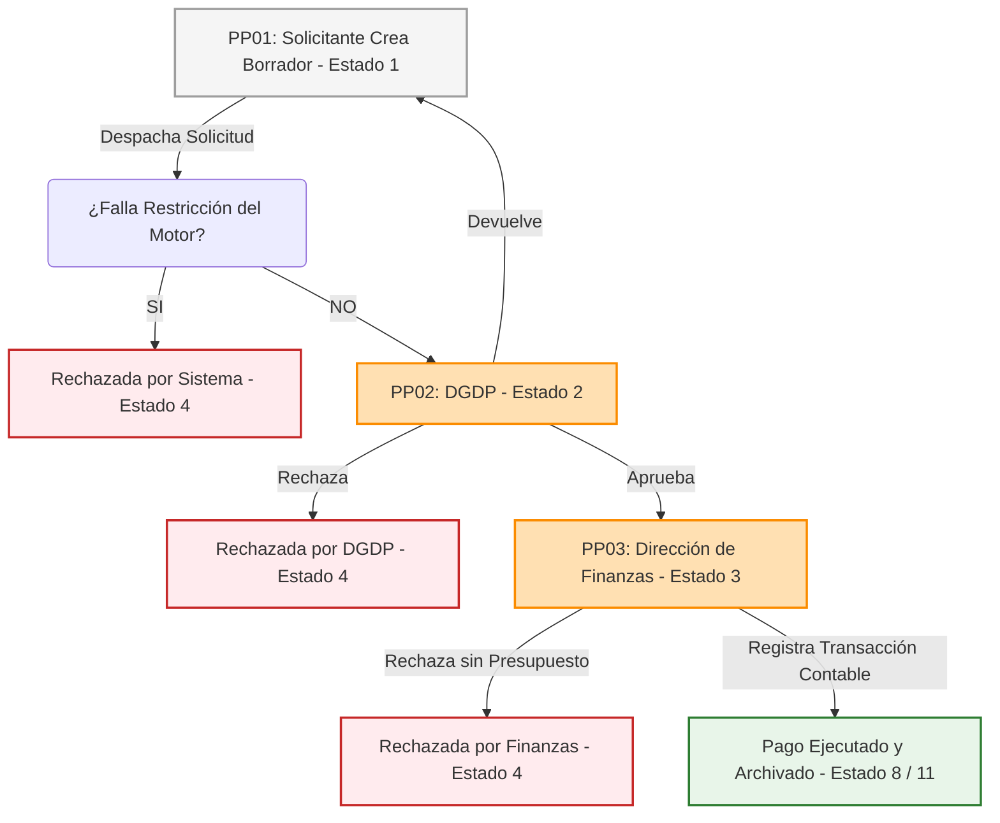

# SG-Solicitudes — Modernización Módulo PDS 2026
## Flujo de Solicitud de Pago Mensual (D9 - Fase 2)
### Documento Maestro de Casos de Uso, Base de Datos y Requerimientos Consolidados

---

# 1. Introducción y Propósito del Sistema de Pagos

El presente documento constituye la **Especificación Técnica Maestra del Workflow de Solicitud de Pago Mensual** correspondiente a la **Fase 2 de Modernización del Módulo PDS — Universidad de La Frontera (UFRO) 2026**.

Este sistema automatiza y controla el proceso recurrente por el cual los prestadores de servicios de la institución realizan el cobro mensual de sus asignaciones asociadas a resoluciones formalizadas bajo el **Decreto N° 009/2026 (D9)**.

El sistema garantiza que:
1. Ningún pago se realice sin un acto administrativo habilitante (Resolución firmada y archivada).
2. Se cumplan en tiempo de ejecución todas las restricciones normativas recurrentes (ausencia de licencias médicas, vigencia del proyecto, no morosidad).
3. Exista disponibilidad presupuestaria líquida real en el Centro de Costo antes de liberar cada cuota de pago.
4. Se mantenga trazabilidad absoluta de las visaciones técnicas, normativas y financieras en cada mes del contrato.

---

# 2. Mapa del Workflow y Transición de Estados

El workflow se activa mensualmente y transiciona a través de los siguientes estados en la tabla `sg_pago_soli.cod_estpago`:



### Tabla de Equivalencia de Estados de Pago (`sg_pago_soli.cod_estpago`):
* **1**: Borrador (Edición exclusiva del Solicitante).
* **2**: Enviada a DGDP (Auditoría normativa y laboral centralizada).
* **3**: Enviada a Finanzas (Revisión presupuestaria final).
* **6**: Devuelta a corrección (Retorna al solicitante con observaciones).
* **4**: Rechazada (Cierre definitivo de la cuota mensual).
* **8**: Pagada (Con transacción bancaria contable registrada).
* **11**: Archivada (Cierre histórico de la transacción).

---

# 3. Diseño del Modelo de Datos de Pagos (SyBase `secgen_db`)

> [!CAUTION]
> **Diseño Histórico Deprecado:** Las tablas satélites antiguas `sg_pago_soli`, `sg_pago_evid`, y `sg_pago_hist` quedan obsoletas y se mantienen únicamente como referencia histórica.

El modelo de datos oficial y principal para la Fase 2 del workflow de pagos se normaliza en las siguientes tablas:
1. **`sg_soli`** (Cabecera Común): Registra la existencia de la solicitud en el sistema y su estado global (`sg_soli.cod_estsol`).
2. **`sg_paso`** (Paso Específico): Vincula el expediente de pago con la PDS de origen (`sg_paso.nro_solpds`).
3. **`sg_fucu`** (Cuota Mensual): Registra el estado de la cuota base del contrato (`sg_fucu.cod_estcuo`).
4. **`sg_pade`** (Detalle de Pago): Desglosa cada funcionario y cuota solicitada en el expediente, permitiendo decisiones individuales (`sg_pade.cod_estdet`) y registrando su número de transacción (`sg_pade.nro_transac`).
5. **`sg_fuev`** (Evidencias/Constancias): Vincula los entregables físicos con el funcionario, mes y pago solicitado.

### Estados Recomendados para Detalle y Cuota (`sg_pade.cod_estdet` / `sg_fucu.cod_estcuo`)
* **BORRADOR**: Solicitud guardada localmente por el solicitante.
* **EN_PROCESO**: Enviada y en proceso de revisión de DGDP.
* **APROBADO_DGDP**: Visada positivamente por DGDP.
* **OBSERVADO**: Detalle con reparos devuelto para corrección del solicitante.
* **RECHAZADO**: Detalle cerrado permanentemente para este intento.
* **PENDIENTE_SALDO**: Detalle validado pero pausado por falta de saldo en Finanzas (permite reintento).
* **PAGADO**: Detalle procesado con transacción bancaria efectiva asignada.

---

# 4. Diseño de Validaciones del Motor (Validaciones a nivel de Detalle `sg_pade`)

Para asegurar la robustez institucional de la UFRO, las validaciones de base de datos se orquestan en procedimientos de base de datos ejecutados por cada detalle.

## 4.1 `sp_pago_validar_restricciones_detalle`
**Objetivo:** Escaneo automático ejecutado en el envío del Solicitante y en la etapa de DGDP. Cruza el RUT del detalle contra `sisper_db`.
* **Pseudocódigo de validación de Licencia Médica:**
  ```sql
  IF EXISTS (SELECT 1 FROM sisper_db..licencias 
             WHERE rut = @rut_fun 
             AND @fecha_periodo BETWEEN fecha_inicio AND fecha_termino)
  BEGIN
      -- Cambia estado del detalle a OBSERVADO y registra el log de error
      UPDATE sg_pade SET cod_estdet = 'OBSERVADO', comentario_excep = 'Registro de Licencia Médica activa en el periodo de ejecución.' WHERE id_pagdet = @id_pagdet;
      INSERT INTO sg_hist (nro_solici, accion, comentario) 
      VALUES (@nro_solici, 'OBSERVAR_DETALLE', 'Alerta automática: Beneficiario registra Licencia Médica activa.');
  END
  ```
* **Pseudocódigo de validación de Permiso sin Goce de Sueldo:**
  ```sql
  IF EXISTS (SELECT 1 FROM sisper_db..permisos 
             WHERE rut = @rut_fun 
             AND tipo_permiso = 'SGO' 
             AND @fecha_periodo BETWEEN fecha_inicio AND fecha_termino)
  BEGIN
      UPDATE sg_pade SET cod_estdet = 'OBSERVADO', comentario_excep = 'Registro de Permiso sin Goce de Sueldo activo en el periodo.' WHERE id_pagdet = @id_pagdet;
  END
  ```

## 4.2 `sp_pago_revisar_presupuesto_detalle`
**Objetivo:** Consultar saldo real disponible en el centro de costos del proyecto.
* **Flujo Operativo:**
  ```sql
  SELECT @saldo_dispo = saldo_liquido, @cod_financ = tipo_financiamiento 
  FROM contabilidad_db..centro_costos 
  WHERE cod_cenco = @cod_cenco;

  IF @cod_financ NOT IN ('21', '44')
  BEGIN
      THROW ERROR 'Financiamiento Incompatible: El Centro de Costos no corresponde a Fondos Propios (21) o Terceros (44).';
  END

  IF @saldo_dispo < @monto_solpag
  BEGIN
      -- En Finanzas se marca como PENDIENTE_SALDO en lugar de rechazo definitivo
      UPDATE sg_pade SET cod_estdet = 'PENDIENTE_SALDO' WHERE id_pagdet = @id_pagdet;
  END
  ```

> [!IMPORTANT]
> **Separación de Responsabilidad:** El rechazo o devolución de un detalle de pago nunca altera la PDS original ni activa el indicador de retiro definitivo del funcionario (`sg_fups.ind_retfun`).

---

# 5. Actualizacion de Modelo Normalizado de Pagos

> [!NOTE]
> Las secciones iniciales de este documento mantienen nombres de trabajo usados en versiones previas, como `sg_pago_soli` o `sg_pago_evid`. Para la normalizacion actual del modelo, el pago se estructura usando `sg_soli`, `sg_paso`, `sg_fucu`, `sg_pade`, `sg_fuev` y `sg_tevi`.

## 5.0 Relación con Solicitud PDS Formalizada

- El pago nace desde una PDS formalizada y con resolución/documento firmado.
- `sg_prse` y `sg_fups` son la fuente de datos aprobados.
- `sg_fume` contiene los meses aprobados por funcionario.
- `sg_fucu` contiene las cuotas generadas desde esos meses aprobados.
- `sg_paso` crea la solicitud formal de pago asociada a la PDS.
- `sg_pade` registra qué cuotas se solicitan pagar.
- `sg_fuev` registra las evidencias/constancias por funcionario/mes/pago.
- El pago no modifica la PDS, funcionarios, meses ni topes aprobados.
- Un rechazo de pago no debe usar `sg_fups.ind_retfun`.

### Matriz de Validaciones de Pago

| Regla | Resuelta en PDS | Revalidar en Pago |
| :--- | :--- | :--- |
| Cargo inhabilitado | Sí | Solo mostrar antecedente |
| Asignación directiva | Sí | Solo mostrar antecedente |
| Formación continua | Sí | Solo mostrar antecedente |
| Tope mensual | Sí | Revalidar si cambia monto solicitado |
| Máximo 2 meses | Sí | Validar cuota generada coherente |
| SEA | Sí | Mostrar antecedente |
| Compensación | Sí | Mostrar y exigir si falta respaldo |
| Licencia médica | Puede haber sido evaluada | Sí, por mes ejecutado |
| Permiso sin goce | Puede haber sido evaluado | Sí, por mes ejecutado |
| Receso | No siempre | Sí, requiere constancia |
| Deudas 2027 | Puede haber sido evaluada | Sí, si fecha aplica |
| Ausencias | No estática | Sí, ajuste proporcional |
| Saldo CC | Informativo/aprobado PDS | Sí, final en Finanzas |
| Evidencia | Planificada | Carga real obligatoria |

## 5.1 Principio de relacion PDS - Pago

La solicitud de pago debe nacer desde una PDS formalizada, pero el pago no debe tratarse como un bloque unico e indivisible de toda la prestacion.

Regla recomendada:

| Nivel | Tabla | Uso |
| :--- | :--- | :--- |
| Cabecera comun | `sg_soli` | Crea la solicitud formal de pago como solicitud del sistema. |
| Cabecera especifica de pago | `sg_paso` | Relaciona la solicitud de pago con la PDS origen mediante `nro_solpds`. |
| Cuota base | `sg_fucu` | Representa la cuota pagable generada desde el mes aprobado del funcionario. |
| Detalle de pago | `sg_pade` | Registra las cuotas/funcionarios incluidos en una solicitud de pago concreta. |
| Evidencia/constancia | `sg_fuev` | Registra respaldos por funcionario, mes y solicitud de pago si aplica. |

## 5.2 Cardinalidad esperada

| Relacion | Regla |
| :--- | :--- |
| Una PDS puede tener muchas solicitudes de pago. | `sg_prse -> sg_paso` mediante `nro_solpds`. |
| Una solicitud de pago pertenece a una sola PDS origen. | `sg_paso.nro_solpds` apunta a `sg_prse.nro_solici`. |
| Una solicitud de pago puede incluir una o muchas cuotas/personas. | `sg_paso -> sg_pade`. |
| Una cuota pertenece a un mes aprobado de un funcionario. | `sg_fucu.id_funmes -> sg_fume.id_funmes`. |
| El pago real se resuelve por detalle. | `sg_pade` permite aprobar, rechazar o dejar pendiente una cuota sin afectar al resto. |

## 5.3 Casos que debe soportar el modelo

| Caso | Comportamiento esperado |
| :--- | :--- |
| Pagar toda la PDS en una solicitud. | `sg_paso` contiene varios registros `sg_pade`. |
| Pagar solo un funcionario de la PDS. | `sg_paso` contiene solo las cuotas de ese funcionario. |
| Pagar un grupo de funcionarios. | `sg_pade` contiene solo los funcionarios/cuotas seleccionados. |
| Rechazar pago de un funcionario por falta de saldo. | Se rechaza o deja pendiente el `sg_pade` correspondiente, sin cerrar todo el pago. |
| Reintentar pago cuando exista saldo. | Se crea una nueva solicitud de pago que vuelve a incluir la cuota si `sg_fucu` no esta pagada ni cerrada. |
| Evitar duplicidad. | Una cuota pagada o en tramite activo no debe volver a seleccionarse. |

## 5.4 Reglas de rechazo parcial y reintento

1. El rechazo de un funcionario en etapa de pago no modifica la PDS original.
2. El rechazo de pago no debe usar `sg_fups.ind_retfun`, porque ese indicador pertenece al flujo PDS.
3. Si el problema afecta solo al intento de pago, se registra en `sg_pade.cod_estdet`.
4. Si el problema afecta la cuota base, se registra en `sg_fucu.cod_estcuo`.
5. Si el rechazo es por falta temporal de saldo, la cuota debe poder volver a solicitarse cuando exista disponibilidad, salvo regla de negocio contraria.

## 5.5 Alertas por etapa y rol

El contador de dias no debe ser global para toda la solicitud. Debe calcularse por etapa o tramo de revision:

| Situacion | Regla |
| :--- | :--- |
| La solicitud entra a una etapa/rol. | Se inicia el contador desde la fecha de entrada. |
| El rol revisa y deriva. | Se cierra el tramo y el siguiente rol inicia contador desde cero. |
| Pasa el plazo definido, por ejemplo mas de 3 dias. | La bandeja debe marcar la solicitud en rojo para ese rol/persona. |
| Se requiere medicion historica por rol. | Puede calcularse con fecha inicio/cierre de cada tramo, usando `sg_hist` si alcanza o una tabla satelite si no. |

Primero se debe revisar si `sg_hist` registra suficiente informacion para calcular el rol pendiente. Si solo registra quien ejecuto la accion, pero no quien recibe la siguiente etapa, se debe evaluar una tabla satelite de tramos/asignacion.

---

# 6. Resumen Consolidado de Pantallas y Roles

Para ver en detalle los flujos individuales por rol, diríjase a sus respectivos documentos técnicos:

1. **Pantalla PP01 (Solicitante/Beneficiario):** [1_requerimientos_solicitante_pago.md](file:///d:/trabajo_ufro_2026/nuevo_workflow_fase_2/template_wf_pagos/requerimientos_wf/1_requerimientos_solicitante_pago.md)
   * *Acción:* Buscar y seleccionar resoluciones PDS activas mediante controles predictivos (por resolución, centro de costo o nombre), visualizar el PDF oficial de la resolución firmada, revisar el balance de meses (pagados, en tránsito, pendientes), visualizar labores/funciones de solo lectura comprometidas en la BDD, y cargar los documentos físicos de respaldo (evidencias de cumplimiento) para solicitar el cobro mensual (solo editable en estado Borrador).
2. **Pantalla PP02 (DGDP - Auditoría de Personas):** [2_requerimientos_dgdp_pago.md](file:///d:/trabajo_ufro_2026/nuevo_workflow_fase_2/template_wf_pagos/requerimientos_wf/2_requerimientos_dgdp_pago.md)
   * *Acción:* Fiscalizar restricciones dinámicas del funcionario (licencias, deudas, permisos, cierre de proyectos). Otorgar o denegar excepciones de receso y prorrateo anual superior al límite de 2 meses.
3. **Pantalla PP03 (Dirección de Finanzas - Ejecución):** [3_requerimientos_direccion_finanzas_pago.md](file:///d:/trabajo_ufro_2026/nuevo_workflow_fase_2/template_wf_pagos/requerimientos_wf/3_requerimientos_direccion_finanzas_pago.md)
   * *Acción:* Control de saldos contables, imputación presupuestaria final del mes, registro contable de egreso (`nro_transac`) y dispersión bancaria del pago.
