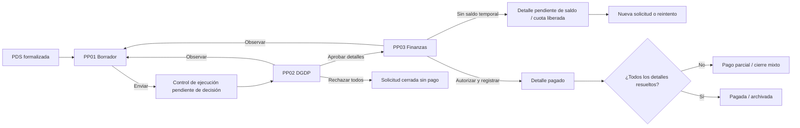
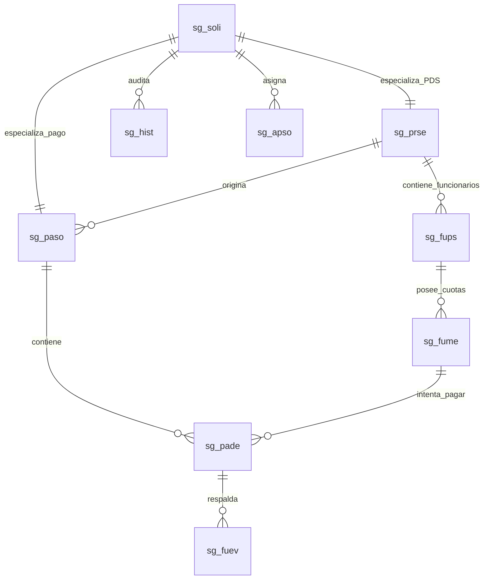

# Requerimientos maestros — Workflow de pagos PDS

**Versión:** 0.3 de levantamiento  
**Fecha:** 2026-08-26  
**Estado:** en descubrimiento; no habilita desarrollo hasta cerrar las decisiones bloqueantes  
**Ámbito:** D.U. 009/2026, DU288/DU09, prestaciones de servicios

## 1. Propósito

Definir cómo una PDS formalizada se transforma en una o varias solicitudes de pago trazables, revisadas por DGDP y resueltas por Finanzas, sin alterar los antecedentes aprobados en la PDS.

Este documento es la fuente maestra. Los documentos PP01, PP02 y PP03 detallan cada etapa. Las maquetas HTML son instrumentos de validación visual y no una definición física de BDD.

## 2. Convención de estado de una definición

| Marca | Significado | Uso |
| :--- | :--- | :--- |
| Confirmado | Existe respuesta explícita o estructura implementada verificable. | Puede transformarse en criterio de aceptación. |
| Preliminar | Existe respuesta informal o inferencia del proyecto. | Debe ratificarse en taller. |
| Pendiente | Falta decisión funcional. | No implementar una alternativa irreversible. |
| Técnico | Recomendación basada en DDL/arquitectura. | Negocio debe validar su efecto funcional. |

## 3. Fuentes revisadas

- Tarjetas de la lista ClickUp [WF de Pago](https://app.clickup.com/90175529655/v/l/901713479167).
- Sprint 0 [Descubrimiento y decisiones](https://app.clickup.com/t/86e2kw64n) y sus doce actividades.
- Requerimientos y respuestas preliminares existentes en esta carpeta.
- DDL real de `sg_soli`, `sg_prse`, `sg_fups`, `sg_fume`, `sg_fuc2`, `sg_fum2`, `sg_ecuo`, `sg_hist` y `sg_apso`.
- PA `Analisis.valida_saldo_cc_cs` e integración ya disponible en backend.
- Maquetas visuales del flujo PDS/solicitud ya desarrollado.

## 4. Alcance funcional

### Incluye

- localizar una PDS formalizada y habilitada;
- mostrar funcionarios, periodos, cuotas, montos y pagos anteriores;
- crear una cabecera de pago y uno o varios detalles;
- adjuntar evidencias y constancias por funcionario/cuota/detalle;
- validar reglas normativas, contractuales y presupuestarias;
- revisar, observar, aprobar o rechazar por detalle;
- registrar falta de saldo sin modificar la PDS;
- autorizar monto, registrar transacción y fecha efectiva;
- mantener historial global e individual;
- soportar corrección, reintento, pago parcial y cierre mixto.

### Fuera de alcance hasta decisión

- ejecutar automáticamente una transferencia bancaria;
- modificar la resolución o los datos aprobados de la PDS;
- definir unilateralmente reglas normativas no confirmadas por DGDP;
- reemplazar sistemas maestros de personas, presupuesto o documentos;
- eliminar datos históricos de `sg_fume`.

## 5. Actores provisionales

| Actor | Responsabilidad provisional | Decisión pendiente |
| :--- | :--- | :--- |
| Solicitante de pago | Seleccionar PDS, detalles, montos y evidencias; enviar a revisión. | Titular, delegado, sustituto y alcance por centro de costo. |
| Responsable de centro de costo/proyecto | Responder por imputación y fondos. | Si siempre coincide con solicitante. |
| Jefatura directa o unidad ejecutora | Certificar ejecución/resultado. | Si participa dentro del workflow o mediante constancia. |
| DGDP | Resolver procedencia normativa por detalle. | Perfiles, excepciones y segunda revisión. |
| Finanzas | Validar saldo, autorizar y registrar resultado financiero. | Límite con Tesorería y forma de reserva. |
| Tesorería/Remuneraciones | Ejecutar o confirmar desembolso. | Integración, respuesta y contingencia. |
| Soporte/administrador | Resolver incidencias sin alterar decisiones. | Acciones administrativas permitidas. |

## 6. Inicio y término propuestos

**Inicio recomendado:** PDS formalizada, con resolución/documento final disponible y al menos un funcionario con saldo pagable. Falta ratificar si además debe cumplirse el periodo/hito antes de crear el borrador.

**Término recomendado:** todos los detalles quedan pagados, rechazados o cerrados sin saldo pendiente; los pagados tienen transacción y fecha efectiva. Falta confirmar si SecGen espera confirmación externa o solo registra el dato informado por Finanzas.

## 7. Flujo objetivo

El nodo de Jefatura/control de ejecución no es obligatorio hasta cerrar S0-008.

## 8. Tres niveles obligatorios de estado

| Nivel | Fuente propuesta | Pregunta que responde |
| :--- | :--- | :--- |
| Cabecera | `sg_soli.cod_estsol` + `sg_paso` | ¿En qué etapa está el expediente completo? |
| Detalle/intento | `sg_pade.cod_estdet` | ¿Qué ocurrió con este funcionario/cuota en esta solicitud? |
| Cuota acumulada | `sg_fume.cod_estcuo` | ¿La cuota sigue disponible, está comprometida o ya fue pagada? |

Los estados no se deben copiar automáticamente entre niveles. Cada transición debe declarar evento, actor, precondiciones, efectos y reversión.

## 9. Modelo conceptual

### Reutilización confirmada técnicamente

- `sg_soli`: cabecera común.
- `sg_prse`: PDS y centro de costo origen.
- `sg_fups`: funcionario, ítem, monto aprobado, rango y tope.
- `sg_fume`: cuota canónica; sustituye la propuesta redundante `sg_fucu`.
- `sg_ecuo`: estados acumulados de cuota.
- `sg_fuc2`: compensación efectivamente realizada.
- `sg_hist`: historial global.
- `sg_apso`, `sg_tfls`, `sg_eta1`: tareas, flujo, etapas y perfiles.

### Estructuras por crear o completar

- `sg_paso`: especialización de solicitud de pago y vínculo a la PDS.
- `sg_pade`: relación solicitud–cuota, montos, decisión y transacción.
- catálogo de estados y causales de detalle;
- evidencia uno-a-muchos asociada a detalle/cuota;
- resultado detallado de validaciones cuando se requiera auditoría;
- cobertura de cuota cuando un pago cubra varios periodos o hitos.

## 10. Requerimientos transversales

| ID | Requerimiento | Estado |
| :--- | :--- | :--- |
| RF-PP-COM-001 | Solo una PDS formalizada y habilitada puede originar pagos. | Preliminar |
| RF-PP-COM-002 | Una solicitud de pago pertenece a una sola PDS. | Recomendado; confirmar |
| RF-PP-COM-003 | Una solicitud puede contener uno o varios funcionarios y cuotas de esa PDS. | Preliminar |
| RF-PP-COM-004 | Toda decisión individual se registra en un detalle; no se modifica `sg_fups.cod_estfun` por rechazo de pago. | Técnico |
| RF-PP-COM-005 | Una cuota pagada o comprometida en otra solicitud enviada no puede seleccionarse. | Confirmado |
| RF-PP-COM-006 | Un borrador no reserva cuota ni presupuesto salvo decisión expresa. | Pendiente |
| RF-PP-COM-007 | El saldo se recalcula al enviar, aprobar y pagar; la validación final no usa caché. | Técnico |
| RF-PP-COM-008 | La falta temporal de saldo permite reintento sin redigitar los antecedentes permanentes. | Preliminar |
| RF-PP-COM-009 | Un pago parcial exige motivo y conserva el saldo pendiente. | Preliminar |
| RF-PP-COM-010 | El expediente conserva historial de actor, perfil, acción, fecha, estado anterior/nuevo y observación. | Confirmado |
| RF-PP-COM-011 | La evidencia se versiona lógicamente; reemplazar no borra el respaldo anterior. | Recomendado |
| RF-PP-COM-012 | La interfaz diferencia favorable, advertencia, observación y bloqueo con color, texto e icono. | Confirmado visualmente |
| RF-PP-COM-013 | Todos los importes nuevos usan `decimal(19,2)`. | Técnico |
| RF-PP-COM-014 | La autorización se ejecuta bajo transacción y evita compromisos concurrentes. | Técnico |
| RF-PP-COM-015 | El cierre global se deriva de los detalles; no se digita manualmente. | Recomendado |

## 11. Validaciones por momento

| Momento | Controles mínimos | Efecto |
| :--- | :--- | :--- |
| Buscar PDS | formalización, acceso al centro de costo, existencia de saldo contractual | filtrar o bloquear selección |
| Guardar borrador | integridad de PDS y pertenencia de detalles | guardar sin reservar, pendiente de decisión |
| Enviar PP01 | cuota disponible, monto, evidencia, duplicidad, tope y saldo | bloquear envío por detalle inválido |
| Resolver DGDP | licencia, inhabilidad, sin goce, compatibilidad, jornada, evidencia y excepción | aprobar, observar o rechazar detalle |
| Recibir Finanzas | recalcular detalle vigente y total aprobado DGDP | excluir detalles no aprobados |
| Autorizar | saldo FIN21 menos compromisos activos SG, centro/item vigente | autorizar o dejar pendiente de saldo |
| Pagar | transacción, fecha, monto autorizado y estado válido | cerrar detalle y actualizar cuota |

Cada regla debe registrar: código, fuente, fecha de evaluación, resultado, severidad, actor, evidencia, posibilidad de excepción y vigencia.

El detalle regla por regla — qué se hereda de la solicitud de resolución, qué se revalida, qué se adapta y qué es nuevo — está en [8_matriz_validaciones_resolucion_a_pago.md](./8_matriz_validaciones_resolucion_a_pago.md).

El inventario de lo que existe hoy —incluida la cadena completa de validación de saldo y su estado real— está en [9_catastro_validaciones_y_saldos.md](./9_catastro_validaciones_y_saldos.md).

## 12. Saldo presupuestario

`valida_saldo_cc_cs` puede reutilizarse con `sg_prse.cod_unifin`, `sg_prse.cod_ccto`, `sg_fups.cod_sitm` y la suma solicitada por combinación de financiamiento.

Brechas por resolver:

- el parámetro `@Afecta` está declarado pero no se usa;
- el PA usa `decimal(15,2)` y el modelo objetivo `decimal(19,2)`;
- los compromisos del nuevo workflow pueden no estar reflejados aún en FIN21;
- falta definir la ruta para `itm_global`, `cc_global` y `pry_global`;
- falta confirmar si se consulta, reserva o solo valida saldo.

## 13. Decisiones bloqueantes

1. Actor titular, delegación, sustitución y segregación de funciones.
2. Evento exacto de inicio y término.
3. Momento y responsable de crear cuotas.
4. Cardinalidad: una PDS por solicitud y agrupación de meses/funcionarios.
5. Catálogos y transiciones de cabecera, detalle y cuota.
6. Reglas repetibles por pago y severidad de cada resultado.
7. Participación de Jefatura Directa.
8. Frontera SecGen–Finanzas–Tesorería.
9. Catálogo, obligatoriedad y vigencia de evidencias.
10. Reserva de cuota/saldo en borrador y tratamiento de concurrencia.

Las preguntas y datos necesarios están en [4_preguntas_transversales_y_datos.md](./4_preguntas_transversales_y_datos.md).

## 14. Definition of Ready para desarrollo

Un requerimiento pasa a desarrollo solo si:

- tiene actor, precondición, disparador y resultado;
- identifica datos de entrada, salida y fuente;
- define validaciones, severidad y mensajes;
- define estados y transiciones afectadas;
- incluye permisos y trazabilidad;
- tiene criterios de aceptación positivos, negativos y de concurrencia;
- no contradice una decisión vigente;
- tiene respuesta o dueño/fecha para cada pregunta bloqueante;
- está vinculado a una tarjeta de ClickUp.

## 15. Próximos entregables

1. Taller S0-001/S0-002: RACI y frontera del flujo.
2. Taller S0-003/S0-005: agregado, cuota, detalle y estados.
3. Taller S0-006/S0-007/S0-010: reglas, severidades y evidencias.
4. Taller S0-008/S0-009: Jefatura y Finanzas/Tesorería.
5. Revisión S0-011: escenarios de aceptación.
6. Cierre S0-012: acta, decisiones y backlog refinado.
