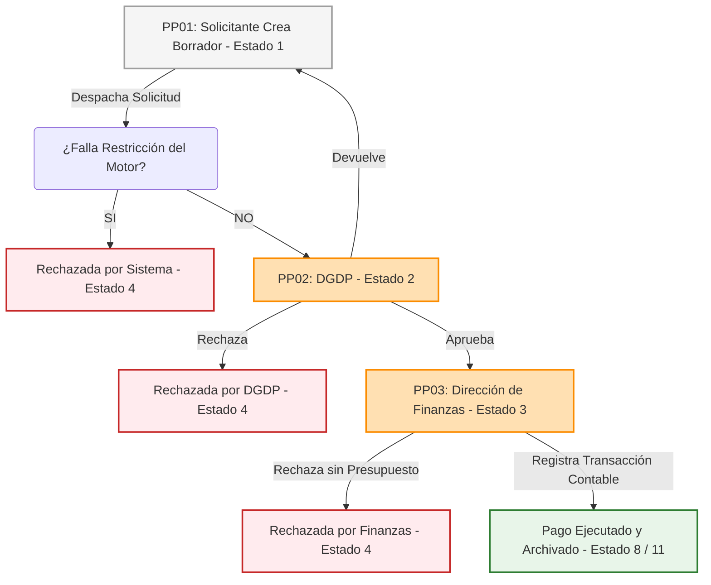

# SG-Solicitudes — Modernización Módulo PDS 2026
## Flujo de Solicitud de Pago Mensual (D9 - Fase 2)
### Documento Maestro de Casos de Uso, Base de Datos y Requerimientos Consolidados

---

# 1. Introducción y Propósito del Sistema de Pagos

El presente documento constituye la **Especificación Técnica Maestra del Workflow de Solicitud de Pago Mensual** correspondiente a la **Fase 2 de Modernización del Módulo PDS — Universidad de La Frontera (UFRO) 2026**.

Este sistema automatiza y controla el proceso recurrente por el cual los prestadores de servicios de la institución realizan el cobro mensual de sus asignaciones asociadas a resoluciones formalizadas bajo el **Decreto N° 009/2026 (D9)**.

El sistema garantiza que:
1. Ningún pago se realice sin un acto administrativo habilitante (Resolución firmada y archivada).
2. Se cumplan en tiempo de ejecución todas las restricciones normativas recurrentes (ausencia de licencias médicas, vigencia del proyecto, no morosidad).
3. Exista disponibilidad presupuestaria líquida real en el Centro de Costo antes de liberar cada cuota de pago.
4. Se mantenga trazabilidad absoluta de las visaciones técnicas, normativas y financieras en cada mes del contrato.

---

# 2. Mapa del Workflow y Transición de Estados

El workflow se activa mensualmente y transiciona a través de los siguientes estados en la tabla `sg_pago_soli.cod_estpago`:



### Tabla de Equivalencia de Estados de Pago (`sg_pago_soli.cod_estpago`):
* **1**: Borrador (Edición exclusiva del Solicitante).
* **2**: Enviada a DGDP (Auditoría normativa y laboral centralizada).
* **3**: Enviada a Finanzas (Revisión presupuestaria final).
* **6**: Devuelta a corrección (Retorna al solicitante con observaciones).
* **4**: Rechazada (Cierre definitivo de la cuota mensual).
* **8**: Pagada (Con transacción bancaria contable registrada).
* **11**: Archivada (Cierre histórico de la transacción).

---

# 3. Diseño del Modelo de Datos de Pagos (SyBase `secgen_db`)

Para no comprometer la estabilidad del sistema actual (Flujo 1 / DU288), el módulo de pagos mensual se implementa mediante **Tablas Satélite** asociadas al circuito contable y de personal.

## 3.1 Estructura de Tablas Nuevas

### 1. Tabla de Solicitud de Pago Mensual (`sg_pago_soli`)
Contiene la cabecera y el estado del cobro mensual de cada funcionario.

| Campo | Tipo SyBase | Restricción | Descripción |
| :--- | :--- | :--- | :--- |
| `id_pago` | `NUMERIC(10,0)` | `PRIMARY KEY IDENTITY` | Identificador único del pago del mes. |
| `nro_soli` | `NUMERIC(10,0)` | `FOREIGN KEY (sg_soli)` | Referencia a la solicitud de PDS original. |
| `nro_resolu` | `NUMERIC(10,0)` | `FOREIGN KEY (sg_reso)` | Referencia al acto administrativo formalizado. |
| `rut_fun` | `VARCHAR(10)` | `NOT NULL` | RUT del prestador beneficiario. |
| `mes_pago` | `TINYINT` | `NOT NULL (1-12)` | Mes del año calendario liquidado. |
| `anio_pago` | `SMALLINT` | `NOT NULL` | Año del calendario liquidado. |
| `labores` | `VARCHAR(1000)` | `NOT NULL` | Redacción textual de las labores ejecutadas. |
| `monto_mes` | `DECIMAL(19,2)` | `NOT NULL` | Monto bruto a transferir en este periodo. |
| `nro_transac`| `VARCHAR(20)` | `NULL` | Código contable bancario (Tesorería). |
| `cod_estpago`| `SMALLINT` | `DEFAULT 1` | Estado en el workflow de pagos. |
| `fecha_crea` | `DATETIME` | `DEFAULT GETDATE()` | Fecha de registro de la cuota. |

### 2. Tabla de Respaldos de Evidencias de Pago (`sg_pago_evid`)
Almacena las referencias físicas de los entregables mensuales.

| Campo | Tipo SyBase | Restricción | Descripción |
| :--- | :--- | :--- | :--- |
| `id_pago_evid`| `NUMERIC(10,0)` | `PRIMARY KEY IDENTITY` | Código de la evidencia subida. |
| `id_pago` | `NUMERIC(10,0)` | `FOREIGN KEY (sg_pago_soli)`| FK de la solicitud de pago mensual. |
| `id_evid_ref`| `NUMERIC(10,0)` | `FOREIGN KEY (sg_fups_evid)`| FK de la evidencia pactada en resolución. |
| `archivo_path`| `VARCHAR(255)` | `NOT NULL` | Ubicación física del documento digital. |
| `fecha_carga`| `DATETIME` | `DEFAULT GETDATE()` | Registro temporal de subida. |

### 3. Bitácora de Historial de Decisiones de Pago (`sg_pago_hist`)
Garantiza la auditoría de cada cambio de estado en el mes.

| Campo | Tipo SyBase | Restricción | Descripción |
| :--- | :--- | :--- | :--- |
| `id_pago_hist`| `NUMERIC(10,0)` | `PRIMARY KEY IDENTITY` | Identificador correlativo del log. |
| `id_pago` | `NUMERIC(10,0)` | `FOREIGN KEY (sg_pago_soli)`| Solicitud afectada. |
| `cod_estpago`| `SMALLINT` | `NOT NULL` | Estado al que transiciona. |
| `rut_usr` | `VARCHAR(10)` | `NOT NULL` | Identificación del operador (Firmante/Sistema). |
| `fecha_hora` | `DATETIME` | `DEFAULT GETDATE()` | Momento del cambio. |
| `comentario` | `VARCHAR(500)` | `NULL` | Justificación técnica de la visación. |

---

# 4. Diseño de Procedimientos Almacenados (Validaciones de Motor)

Para asegurar la robustez institucional de la UFRO, las validaciones de base de datos se orquestan en procedimientos de base de datos ejecutados al cambiar de etapa.

## 4.1 `sp_pago_validar_restricciones`
**Objetivo:** Escaneo automático ejecutado en el envío del Solicitante y en la etapa de DGDP. Cruza el RUT y el periodo contra `sisper_db`.
* **Pseudocódigo de validación de Licencia Médica:**
  ```sql
  IF EXISTS (SELECT 1 FROM sisper_db..licencias 
             WHERE rut = @rut_fun 
             AND @fecha_periodo BETWEEN fecha_inicio AND fecha_termino)
  BEGIN
      -- Cambia estado a Rechazada por Sistema
      UPDATE sg_pago_soli SET cod_estpago = 4 WHERE id_pago = @id_pago;
      INSERT INTO sg_pago_hist (id_pago, cod_estpago, rut_usr, comentario) 
      VALUES (@id_pago, 4, 'SISTEMA', 'Rechazo automático: Beneficiario registra Licencia Médica activa en el periodo.');
      THROW ERROR 'Operación Bloqueada: Funcionario presenta Licencia Médica vigente.';
  END
  ```
* **Pseudocódigo de validación de Permiso sin Goce de Sueldo:**
  ```sql
  IF EXISTS (SELECT 1 FROM sisper_db..permisos 
             WHERE rut = @rut_fun 
             AND tipo_permiso = 'SGO' 
             AND @fecha_periodo BETWEEN fecha_inicio AND fecha_termino)
  BEGIN
      UPDATE sg_pago_soli SET cod_estpago = 4 WHERE id_pago = @id_pago;
      INSERT INTO sg_pago_hist (id_pago, cod_estpago, rut_usr, comentario) 
      VALUES (@id_pago, 4, 'SISTEMA', 'Rechazo automático: Beneficiario registra Permiso sin Goce de Sueldo activo en el periodo.');
      THROW ERROR 'Operación Bloqueada: Funcionario presenta Permiso sin Goce de Sueldo activo.';
  END
  ```

## 4.2 `sp_pago_revisar_presupuesto`
**Objetivo:** Consultar saldo real disponible en el centro de costos del proyecto y asegurar que no sea de uso estructural o prohibido.
* **Flujo Operativo:**
  ```sql
  SELECT @saldo_dispo = saldo_liquido, @cod_financ = tipo_financiamiento 
  FROM contabilidad_db..centro_costos 
  WHERE cod_cenco = @cod_cenco;

  IF @cod_financ NOT IN ('21', '44')
  BEGIN
      THROW ERROR 'Financiamiento Incompatible: El Centro de Costos seleccionado no corresponde a Fondos Propios (21) o Terceros (44).';
  END

  IF @saldo_dispo < @monto_mes
  BEGIN
      -- Alerta pero no bloquea automáticamente en creación, bloquea estrictamente en la etapa de Finanzas PP04
      PRINT 'Advertencia: Saldo insuficiente en el Centro de Costos.';
  END
  ```

---

# 5. Resumen Consolidado de Pantallas y Roles

Para ver en detalle los flujos individuales por rol, diríjase a sus respectivos documentos técnicos:

1. **Pantalla PP01 (Solicitante/Beneficiario):** [1_requerimientos_solicitante_pago.md](file:///d:/trabajo_ufro_2026/nuevo_workflow_fase_2/template_wf_pagos/requerimientos_wf/1_requerimientos_solicitante_pago.md)
   * *Acción:* Buscar y seleccionar resoluciones PDS activas mediante controles predictivos (por resolución, centro de costo o nombre), visualizar el PDF oficial de la resolución firmada, revisar el balance de meses (pagados, en tránsito, pendientes), visualizar labores/funciones de solo lectura comprometidas en la BDD, y cargar los documentos físicos de respaldo (evidencias de cumplimiento) para solicitar el cobro mensual (solo editable en estado Borrador).
2. **Pantalla PP02 (DGDP - Auditoría de Personas):** [2_requerimientos_dgdp_pago.md](file:///d:/trabajo_ufro_2026/nuevo_workflow_fase_2/template_wf_pagos/requerimientos_wf/2_requerimientos_dgdp_pago.md)
   * *Acción:* Fiscalizar restricciones dinámicas del funcionario (licencias, deudas, permisos, cierre de proyectos). Otorgar o denegar excepciones de receso y prorrateo anual superior al límite de 2 meses.
3. **Pantalla PP03 (Dirección de Finanzas - Ejecución):** [3_requerimientos_direccion_finanzas_pago.md](file:///d:/trabajo_ufro_2026/nuevo_workflow_fase_2/template_wf_pagos/requerimientos_wf/3_requerimientos_direccion_finanzas_pago.md)
   * *Acción:* Control de saldos contables, imputación presupuestaria final del mes, registro contable de egreso (`nro_transac`) y dispersión bancaria del pago.

